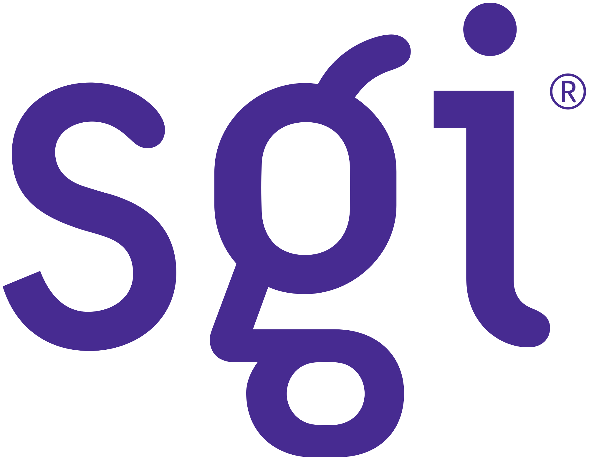

# Charte\_anti-plagiat\_Projet\_FYC\_

**ANNEXE 2 - LA CHARTE DE L’ETUDIANT : LE PLAGIAT – A REMETTRE AVEC LA VERSION FINALE IMPRIMEE DU PROJET FYC**

La contrefaçon est l’appellation juridique du plagiat, sa version condamnable. A ce titre, elle constitue un délit. L’article 335-3 du Code de la propriété intellectuelle en précise la nature : il s’agit de " toute reproduction, représentation ou diffusion, par quelque moyen que ce soit, d’une œuvre de l’esprit en violation des droits d’auteur, tels qu’ils sont définis et réglementés par la loi". Elle est susceptible de donner lieu à des sanctions civiles et pénales.

Ainsi, le plagiat consiste à copier, contrefaire ou falsifier un document sujet à une évaluation et d’utiliser en tout ou partie, l’œuvre d’autrui ou des passages tirés de celle-ci, sans les identifier expressément comme citations et dans l’intention de les faire passer pour siens.

De même, lorsque vous reprenez « mot pour mot » un passage d’un auteur, il faut impérativement le signaler avec des guillemets et indiquer en bas de pages, la source ainsi que son numéro de page.

**Sanctions disciplinaires**

Le plagiat est sanctionné par :

* un 0/20 sur le dossier ou le projet
* le passage devant le Conseil de Discipline
* les sanctions peuvent aller jusqu’à l’exclusion définitive des examens
* toute récidive peut se traduire par une exclusion temporaire ou définitive de l’établissement.

**Déclaration sur l’honneur - ANNEE SCOLAIRE 2020-2021**

**A remettre complétée et signée en annexe du Projet FYC**

|  **Nom** | **Prénom** | **Formation** |
| :--- | :--- | :--- |
| Vazelle | Florian | 3DJV |
| Thénevin | Antoine | 3DJV |
| Lin | Shenjun | 3DJV |
|  |  |  |

Nom du Mentor **M. Lioret**

Nous soussignés **M. Vazelle**, **M.Thénevin** et **M. Lin** attestons avoir pris connaissance du règlement intérieur de l’école et certifie \(ons\) que le dossier ou projet de recherche ci-joint ne fait l’objet d’aucun plagiat. Par ailleurs, nous nous m’engageons à respecter les règles du dit règlement intérieur et les sanctions disciplinaires qui en découlent.

Fait à Paris, le **08/02/2021**

Signatures de tous les participants au projet

Précédées de la mention « lu et approuvé » 

Lu et approuvé

      

