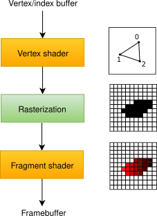
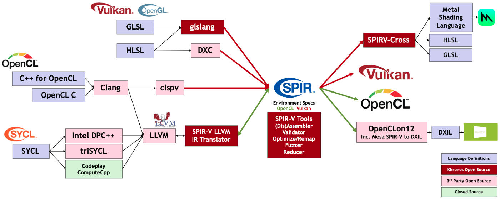

# Graphic Pipeline

Le Graphic Pipeline, au sens général, définit toute la tuyauterie, toute les opérations qu'éxecute notre GPU pour nous sortir un rendu. Pour résumé, cette tuyauterie :

* on lui passe en entré des Vertex/Index Buffers
* on obtient en sortie des pixels rendus sur un Framebuffer

Le Graphic Pipeline, au sens de Vulkan, est très complexe et nous n'allons donc en voir qu'une version simplifiée.



## Shader

Nous aurons donc deux étapes dite de shader. Créons un dossier `shaders` avec dedans les deux shaders, qui sont très classique, ci-dessous :


```cpp
#version 450
#extension GL_ARB_separate_shader_objects : enable

out gl_PerVertex {
    vec4 gl_Position;
};

layout(location = 0) out vec3 fragColor;

// On stock en dure les coordonnées du triangle
vec2 positions[3] = vec2[](
    vec2(0.0, -0.5),
    vec2(0.5, 0.5),
    vec2(-0.5, 0.5)
);

// Et ces couleurs
vec3 colors[3] = vec3[](
    vec3(1.0, 0.0, 0.0),
    vec3(0.0, 1.0, 0.0),
    vec3(0.0, 0.0, 1.0)
);

void main() {
    gl_Position = vec4(positions[gl_VertexIndex], 0.0, 1.0);
    fragColor = colors[gl_VertexIndex];
}
```



```cpp
#version 450
#extension GL_ARB_separate_shader_objects : enable

layout(location = 0) in vec3 fragColor;

layout(location = 0) out vec4 outColor;

void main() {
    outColor = vec4(fragColor, 1.0);
}
```


### Compilation en SPIR-V

Nous en avions déjà parler, en Vulkan il faut compiler les shaders en bytecode SPIR-V. Le SPIR-V a un énorme intérêt d'intéropabilité des shaders. Il y a plusieurs outils pour cela, voici quelque exemple :

* pour la compilation GLSL : `glslc`, `glslangValidator`
* pour la compilation des compute shader OpenCL : `clspv`



## Pipeline

Créons une fonction `createGraphicsPipeline` et appelons-la depuis `initVulkan` après `createImageViews`. 

```cpp
void initVulkan() {
    ...
    createImageViews();
    createGraphicsPipeline();
}
```

### Pipeline Layout

```cpp
const VkDescriptorSetLayout layouts[]               = {m_descriptorSetLayout.handle()};
const VkPipelineLayoutCreateInfo pipelineLayoutInfo = {
    .sType          = VK_STRUCTURE_TYPE_PIPELINE_LAYOUT_CREATE_INFO,
    .setLayoutCount = 1,
    .pSetLayouts    = layouts,
};

if (vkCreatePipelineLayout(m_device.logical(), &pipelineLayoutInfo, nullptr, &m_layout) != VK_SUCCESS) {
  throw std::runtime_error("Pipeline Layout creation failed");
}
```

### Graphic Pipeline

#### Vertex Input

```cpp
VkPipelineVertexInputStateCreateInfo vertexInputInfo = {
    .sType                           = VK_STRUCTURE_TYPE_PIPELINE_VERTEX_INPUT_STATE_CREATE_INFO,
    .vertexBindingDescriptionCount   = 0,
    .vertexAttributeDescriptionCount = 0,
};
```

#### Input Assembly

```cpp
/**
  * On spécifie comment le GPU doit assemblée les données en entré
  * Ici on organise nos sommets en triangles
  */
VkPipelineInputAssemblyStateCreateInfo inputAssembly = {
    .sType                  = VK_STRUCTURE_TYPE_PIPELINE_INPUT_ASSEMBLY_STATE_CREATE_INFO,
    .topology               = VK_PRIMITIVE_TOPOLOGY_TRIANGLE_LIST,
    .primitiveRestartEnable = VK_FALSE,
};
```

#### Viewport

```cpp
// Pipeline viewport
viewport = {
    .x      = 0.0f,
    .y      = 0.0f,
    .width  = static_cast<float>(swapChainExtent.width),
    .height = static_cast<float>(swapChainExtent.height),
    // Depth buffer range
    .minDepth = 0.0f,
    .maxDepth = 1.0f,
};

// Pixel boundary cutoff
scissor = {
    .offset  = {0, 0},
    .extent = swapChainExtent,
};

// Combine viewport(s) and scissor(s) (some graphics cards allow multiple of each)
VkPipelineViewportStateCreateInfo viewportState = {
    .sType         = VK_STRUCTURE_TYPE_PIPELINE_VIEWPORT_STATE_CREATE_INFO,
    .viewportCount = 1,
    .pViewports    = &viewport,
    .scissorCount  = 1,
    .pScissors     = &scissor,
};
```

#### Rasterizer

```cpp
VkPipelineRasterizationStateCreateInfo rasterizer = {
    .sType = VK_STRUCTURE_TYPE_PIPELINE_RASTERIZATION_STATE_CREATE_INFO,
    // Clip fragments instead of clipping them to near and far planes
    .depthClampEnable = VK_FALSE,
    // Don't allow the rasterizer to discard geometry
    .rasterizerDiscardEnable = VK_FALSE,
    // Fill fragments
    .polygonMode = VK_POLYGON_MODE_FILL,
    .cullMode    = VK_CULL_MODE_BACK_BIT,
    .frontFace   = VK_FRONT_FACE_COUNTER_CLOCKWISE,
    // Bias depth values
    // This is good for shadow mapping, but we're not doing that currently
    // so we'll disable for now
    .depthBiasEnable = VK_FALSE,
    .lineWidth       = 1.0f,
};
```

#### Multisampling

```cpp
VkPipelineMultisampleStateCreateInfo multisampling = {
    .sType                = VK_STRUCTURE_TYPE_PIPELINE_MULTISAMPLE_STATE_CREATE_INFO,
    .rasterizationSamples = VK_SAMPLE_COUNT_1_BIT,
    .sampleShadingEnable  = VK_FALSE,
    .minSampleShading     = 1.0f,
};
```

#### Color Blending

```cpp
VkPipelineColorBlendAttachmentState colorBlendAttachment = {
    // Disable blending
    .blendEnable    = VK_FALSE,
    .colorWriteMask = VK_COLOR_COMPONENT_R_BIT | VK_COLOR_COMPONENT_G_BIT | VK_COLOR_COMPONENT_B_BIT | VK_COLOR_COMPONENT_A_BIT,
};

VkPipelineColorBlendStateCreateInfo colorBlending = {
    .sType           = VK_STRUCTURE_TYPE_PIPELINE_COLOR_BLEND_STATE_CREATE_INFO,
    .attachmentCount = 1,
    .pAttachments    = &colorBlendAttachment,
};
```

#### Depth Stencil

```cpp
VkPipelineDepthStencilStateCreateInfo depthStencil = {
        .sType             = VK_STRUCTURE_TYPE_PIPELINE_DEPTH_STENCIL_STATE_CREATE_INFO,
        .depthTestEnable   = VK_TRUE,
        .depthWriteEnable  = VK_TRUE,
        .depthCompareOp    = VK_COMPARE_OP_LESS_OR_EQUAL,  // Cull front faces
        .stencilTestEnable = VK_FALSE,
        .back = {
                .compareOp = VK_COMPARE_OP_ALWAYS,
        },
};
```


```cpp
const VkShaderModule vertShaderModule = createShaderModule(DEPTH_BASIC_VERT);
shaderStages[0] = misc::pipelineShaderStageCreateInfo(vertShaderModule, VK_SHADER_STAGE_VERTEX_BIT);

const VkGraphicsPipelineCreateInfo info = {
    .sType               = VK_STRUCTURE_TYPE_GRAPHICS_PIPELINE_CREATE_INFO,
    .stageCount          = 2,
    .pStages             = shaderStages.data(),
    .pVertexInputState   = &vertexInputInfo,
    .pInputAssemblyState = &inputAssembly,
    .pViewportState      = &viewportState,
    .pRasterizationState = &rasterizer,
    .pMultisampleState   = &multisampling,
    .pDepthStencilState  = &depthStencil,
    .pColorBlendState    = &colorBlending,
    .pDynamicState       = nullptr,
    .layout              = m_layout,
    .renderPass          = m_renderPass.handle(),
    // Pipeline will be used in first sub pass
    .subpass            = 0,
    .basePipelineHandle = VK_NULL_HANDLE,
    .basePipelineIndex  = -1,
};

if (vkCreateGraphicsPipelines(m_device.logical(), VK_NULL_HANDLE, 1, &info, nullptr, &m_pipeline) != VK_SUCCESS) {
  throw std::runtime_error("Graphics Pipeline creation failed");
}
```

**Vidéo / Code :**







