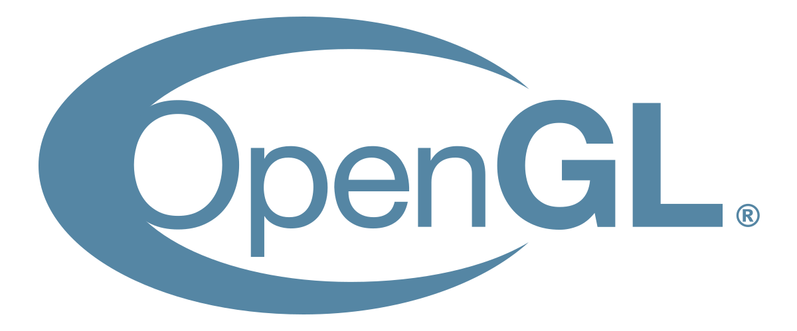

# Histoire


Une API \(pour Application Programming Interface\) est un ensemble normalisé de classes, de méthodes, de fonctions et de constantes.


## OpenGL

OpenGL pour Open Graphics Library est un ensemble normalisé de fonctions de calcul d'images 2D ou 3D, permettant par exemple d’afficher de la géométrie, changer une couleur, mettre une texture dessus.

Initialement lancée par Silicon Graphics en 1992, cette API graphique est disponible sur de nombreuses plateformes où elle est utilisée pour des applications de domaine variées, tels que le jeu vidéo, la modélisation... C’est en 2006 que Khronos Group récupère le contrôle de la spécification OpenGL.

OpenGL a maintenant bientôt 30 ans et depuis 1992, les cartes graphiques ont énormément évolué. Une des évolutions les plus marquantes est l'apparition des shaders. 


Un shader est un programme informatique, utilisé en image de synthèse, pour paramétrer une partie du processus de rendu réalisé par une carte graphique ou un moteur de rendu logiciel.


Bien qu'OpenGL 4.0 intègre toutes les dernières nouveautés, le support d'OpenGL 1.0 est toujours inclus dans les pilotes graphiques. De plus, l'architecture principale d'OpenGL n'a pas changé depuis 1992 causant des soucis d'évolution. On peut noter :

* le non support du multithreading
* la compilation des shaders dépend de l'implémentation du constructeur
* l'absence d'outils standard/officiels pour OpenGL

## Mantle

C’est en fin 2013, qu’AMD dévoile une nouvelle bibliothèque graphique, appelée Mantle. Celle-ci possède la particularité de donner aux développeurs un meilleur contrôle sur le GPU \(pour Graphics Processing Unit\).

En effet, avec les bibliothèques comme OpenGL ou encore Direct3D 11, le driver n'a aucun moyen de savoir exactement ce que veut le développeur, et donc il n'a aucun moyen d'optimiser le processus. En donnant un accès plus bas niveau au GPU, les développeurs peuvent réaliser exactement ce qu'ils veulent. De plus, le pilote accorde une plus grande confiance aux développeurs, allégeant ainsi la complexité de l'implémentation et son utilisation CPU \(pour Central Processing Unit\).

Peu de temps après, Microsoft présente Direct3D 12, reprenant les mêmes concepts, puis c'est au tour d'Apple avec Metal. Finalement, Khronos annonce aussi une évolution de la bibliothèque OpenGL, nommée OpenGL Next. Pour celle-ci, AMD affirme vouloir apporter tout son support et son expérience avec Mantle.

## **Vulkan**

Khronos dévoile Vulkan, le successeur d'OpenGL, au cours de la Game Developers Conference de 2015. La première version est sortie en février 2016, 25 ans après la sortie d’OpenGL.

Vulkan corrige les problèmes d’OpenGL, il peut optimiser l’utilisation d’un processeur doté de multiples cœurs pour mieux répartir la charge et tirer partie des performances maximales.

Avec l’arrivée des nouvelles cartes graphiques multicœur et de leurs nouvelles architectures, le besoin de  tirer partie au maximum du matériel graphique est devenu primordial. Vulkan a été développé pour couvrir ce besoin et donner la possibilité au développeur de cibler une architecture graphique et de développer son application en exploitant au maximum les fonctionnalités que lui apporte son matériel.

Vulkan vise également à unifier le développement sur plateformes mobiles \(OpenGL ES\) et bureautiques \(OpenGL\). Il est également multi-plateforme \(Windows, Linux, Android, MacOS, IOS …\).

