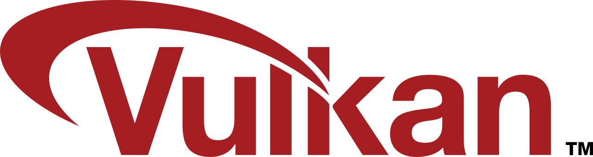

# Histoire


Une API \(pour Application Programming Interface\) est un ensemble normalisé de classes, de méthodes, de fonctions et de constantes.


## OpenGL

OpenGL pour Open Graphics Library est une API graphique de calcul d'images 2D ou 3D, permettant par exemple d’afficher de la géométrie, changer une couleur, mettre une texture dessus.

Initialement lancée par Silicon Graphics en 1992, cette API graphique est disponible sur de nombreuses plateformes où elle est utilisée pour des applications de domaine variées, tels que le jeu vidéo, la modélisation... En 2006, Khronos Group récupère la direction de l'API.

Depuis, la création d'OpenGL, les cartes graphiques ont drastiquement évolué et les shaders sont apparu.


Un shader est un programme informatique, utilisé en image de synthèse, pour paramétrer une partie du processus de rendu réalisé par une carte graphique ou un moteur de rendu logiciel.


Quant à OpenGL, son architecture n'a pas réellement évolué. Ces nouvelles version regroupe les nouveautés qu'offre les cartes graphique actuelle \(tels que les shaders de tesselation\), cependant OpenGL 1 est toujours supporter par beaucoup de de driver. Tout cela, peut causer des soucis et complique les mises à jour d'OpenGL. 

Certaines choses qu'OpenGL ne fait pas :

* le multithreading
* des outils standard
* une compilation des shaders indépendante de l'implémentation du constructeur

## Mantle

En 2013, AMD dévoile sa nouvelle API graphique, Mantle. Sa différence avec les autres librairies du même style, est qu'elle donne aux développeurs plus de liberté et un meilleur contrôle sur le GPU \(pour Graphics Processing Unit\).

Avec les librairies conventionnelles \(comme OpenGL\), les drivers n'ont pas beaucoup d'information sur comment le programme fonctionne. Mantle est une API bas niveau, où les développeurs explicitent leur besoin, l'API pourra ainsi optimiser le programme.

Mantle a eu un grand impact car peu de temps après, c'est au tour de Microsoft de présenter Direct3D 12, Apple avec Metal puis le Khronos Group annonce une évolution d'OpenGL, s'appelant au départ OpenGL Next.

## **Vulkan**

OpenGL Next ce transforme finalement en Vulkan et Khronos le dévoile, en 2015, lors de la Game Developers Conference. La première version est sortie en février 2016, 25 ans après la sortie d’OpenGL.

Avec l’arrivée des nouvelles cartes graphiques multicœur et de leurs nouvelles architectures, le besoin de  tirer partie au maximum du matériel graphique est devenu primordial. Vulkan a été développé pour couvrir ce besoin et donner la possibilité au développeur de cibler une architecture graphique et de développer son application en exploitant au maximum les fonctionnalités que lui apporte son matériel.

Vulkan vise également à unifier le développement sur plateformes mobiles \(OpenGL ES\) et bureautiques \(OpenGL\). Il est également multi-plateforme \(Windows, Linux, Android, MacOS, IOS …\).

